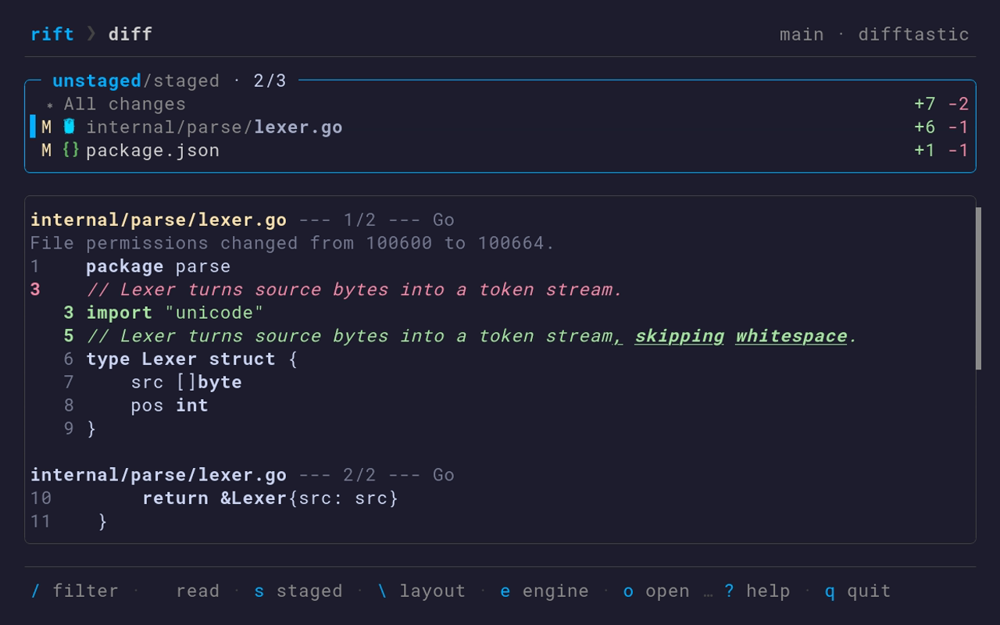
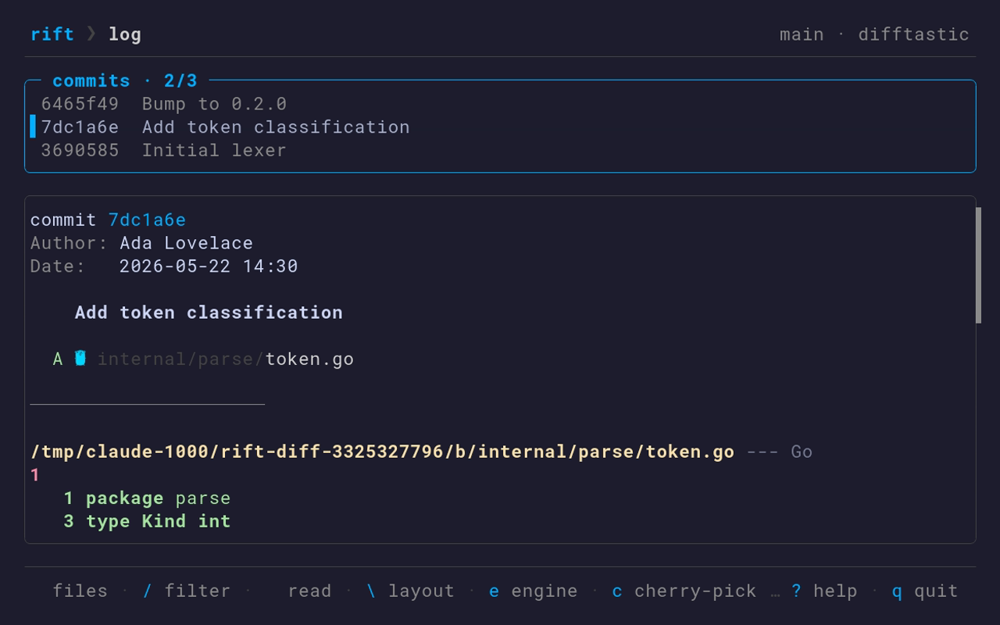
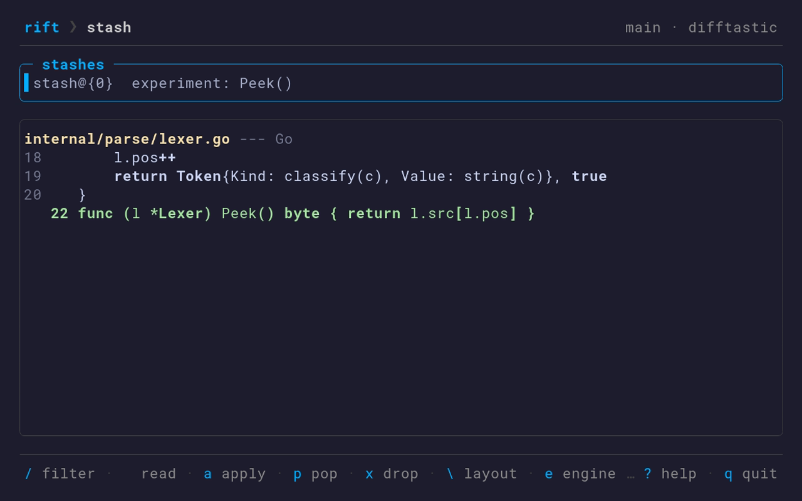

# rift

Syntax-aware, worktree-aware, composable fuzzy git tool.

rift wraps the git workflows where UX is the bottleneck — staging, diffing, log browsing, stashing — with structural understanding via [difftastic](https://difftastic.wilfred.me.uk/) and composable output that works for both humans and scripts.

```
rift              # contextual launchpad
rift diff         # syntax-aware diff browser
rift stage        # interactive staging with hunk granularity
rift log          # structural commit explorer
rift stash        # stash manager with diff preview
```

rift is **worktree-aware** — every command reads correctly inside bare-repo and linked-worktree layouts — but it does not *manage* worktrees or branches. For creating, switching, and pruning worktrees, pair it with [worktrunk](https://github.com/max-sixty/worktrunk).

<p align="center">
  
</p>

## Why

[forgit](https://github.com/wfxr/forgit) and [git-fuzzy](https://github.com/bigH/git-fuzzy) proved that fuzzy search over git objects is a massive UX win. But they're shell scripts piping strings through fzf — every diff is flat text, and you can't pipe the output into anything.

[lazygit](https://github.com/jesseduffield/lazygit) is the gold standard for git TUIs, but it's a resident app you live inside, with no composable output and line-based diffs.

rift occupies the space between them: **transient** (invoke, act, return to shell), **structural** (diffs understand your code's syntax), and **composable** (every command has `--print` and `--json` modes).

## Key Features

### Structural diffs

Powered by difftastic: reformatting noise disappears and you see what actually changed at the expression level, with syntax highlighting and intra-line emphasis. When difftastic isn't on your `$PATH`, rift falls back to git's own diff (with word-level and whitespace highlighting) — toggle between the two engines with `e`.



### Split-pane browsing

`rift diff` and `rift log` are two-panel browsers: a fuzzy-filterable list on the left, a structural diff preview on the right. Navigate with vim keys, jump hunk-to-hunk, and keep your place with a scrollbar and a sticky file header. Colored file-type icons and dimmed directories make the list scan fast. In the log, press `⏎` to drill into a commit's files, or `c` / `r` to cherry-pick / revert the selected commit.



`rift stash` shares the same browser for stash entries and their diffs:



### Test lens

Add `--tests` to `rift diff` or `rift log` to read a change by the *tests* it touches instead of its files — handy for reviewing agent-generated code. Each spec is marked by how the diff changed it: `+` added, `→` renamed, `~` modified (the `~` cases, where an assertion can be quietly weakened under an unchanged name, are the ones worth a close read). The preview scrolls to the selected test and names it in the border. Toggle live between the file view and the tests view with `t`; works on the working tree, `--staged`, or a commit range, and supports `--print` / `--json`. Tests are extracted across Go, JavaScript/TypeScript, Ruby, Python, and Rust — including `t.Run` subtests and table-driven cases.


### Review tracking

In `rift diff`, press `r` to mark the selected file **reviewed** (a `✓` replaces its status glyph) and `U` to show only the files you haven't reviewed yet — so you can walk a large change file by file and watch the list shrink as you tick each one off. A mark is keyed to the file's content, so it **resets the moment the file changes** (e.g. an agent edits it again) and re-applies on revert, making it easy to re-review only what's new. Marks persist per worktree (in `.git/rift/`, uncommitted); `--unreviewed` narrows `--print` / `--json` / `--name-only` to the not-yet-reviewed files.


### Interactive staging

`rift stage` replaces `git add -p` with a two-panel TUI: a file list with structural diff preview and hunk-level staging, the active hunk clearly marked in the gutter.


### Composable output

Every command is interactive by default but never traps you — each supports `--print` (plain selection) and `--json` (structured) modes:

```bash
rift log                              # interactive TUI
rift log --print                      # one commit hash per line
rift log --json                       # structured JSON

# pipe into anything
rift diff --print | xargs -r "$EDITOR"          # open every changed file
rift log --json | jq '.[] | select(.files_changed > 10)'
```

### Shared TUI

Every screen behaves the same: type `/` to fuzzy-filter, `⇥` to switch panes, vim keys (`j`/`k`, `gg`/`G`, `ctrl-d`/`u`) to scroll, `\` to toggle the diff layout, `y` to yank the selection, `o` to open a file in `$EDITOR` at the change, `?` for the keybinding overlay, and `esc` to step back.

## Installation

```bash
curl -fsSL https://raw.githubusercontent.com/madhermit/rift/main/install.sh | bash
```

Or with Go 1.25+:

```bash
go install github.com/madhermit/rift@latest
```

Pre-built binaries for Linux and macOS are available on the [Releases](https://github.com/madhermit/rift/releases) page.

### External Tools

On first run, rift automatically downloads [difftastic](https://difftastic.wilfred.me.uk/) to `~/.local/share/rift/bin/` if it's not already on your `$PATH`. If it's unavailable (offline, or the download fails), rift falls back to git's own diff with word-level highlighting — no external tools are required.

## Agent-Friendly

The `--json` output on every command gives agents structural understanding that raw git can't provide:

```bash
# inspect changes as structured data
rift diff --json | jq '.[] | select(.status == "modified")'

# list recent commits
rift log --json -n 10 | jq '.[].hash'
```

## Status

The core consumption commands — `diff`, `log`, `stash`, `stage` — are implemented and meant to be a daily driver (latest tag **v0.5.0**), with ongoing work on the diff/log reading experience: colored file icons, scrollbars, sticky file headers, and a structural fallback when difftastic is absent. Config and local code review are planned next.

Worktree and branch *management* are intentionally out of scope — rift stays worktree-aware and pairs with [worktrunk](https://github.com/max-sixty/worktrunk).

See [CHANGELOG.md](CHANGELOG.md) for release notes.

## License

[MIT](LICENSE)
